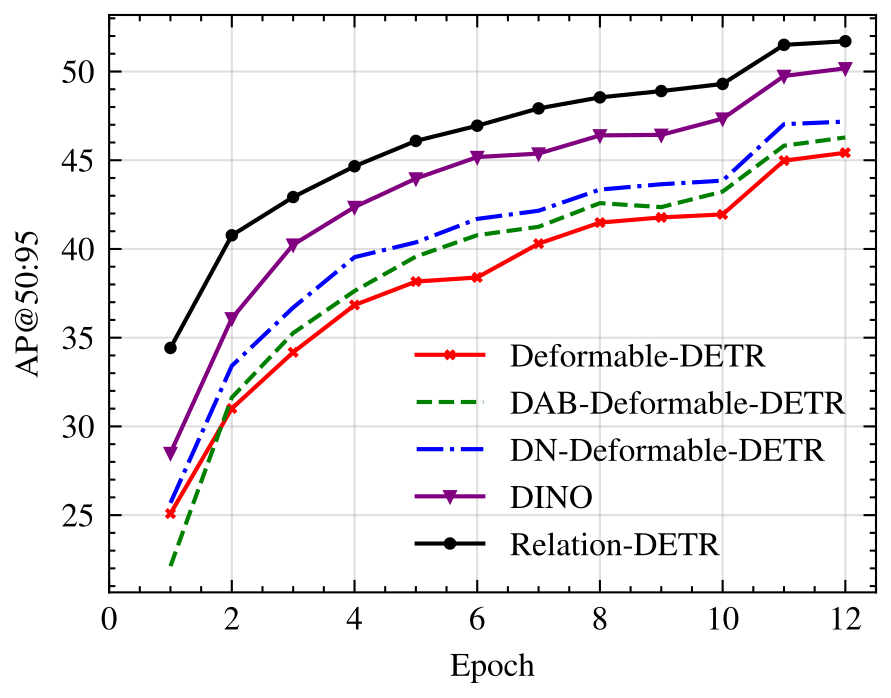

**Relation DETR**
===

By [Xiuquan Hou](https://github.com/xiuqhou), [Meiqin Liu](https://scholar.google.com/citations?user=T07OWMkAAAAJ&hl=zh-CN&oi=ao), Senlin Zhang, [Ping Wei](https://scholar.google.com/citations?user=1OQBtdcAAAAJ&hl=zh-CN&oi=ao), [Badong Chen](https://scholar.google.com/citations?user=mq6tPX4AAAAJ&hl=zh-CN&oi=ao), Xuguang Lan.

This repo is the official implementation of [Relation DETR: Exploring Explicit Position Relation Prior for Object Detection](https://arxiv.org/abs/2407.11699v1).

💖 If our [Relation-DETR](https://github.com/xiuqhou/Relation-DETR) or [SA-Det-100k](https://huggingface.co/datasets/xiuqhou/SA-Det-100k/tree/main) dataset is helpful to your researches or projects, please star this repository. Thanks! 🤗

<div align="center">
    
</div>

## TODO

...Want more features? Open a [Feature Request](https://github.com/xiuqhou/Relation-DETR/issues/new?assignees=&labels=enhancement&projects=&template=feature-request-english.yml).

- [ ] Support data augmentations from `albumentations`.
- [ ] Support Mosaic and Mixup data augmentation.
- [ ] More detailed docs for the code.
- [ ] Add a instruction about introducing our relation to other models.
- [ ] Support GradCam and feature visualization.
- [ ] Upload more pretrained weights and training logs.
- [x] Update visualization code for MC.
- [x] Update Model ZOO.

## Update

- [2024-07-24] Upload SA-Det-100k dataset, see it in [Hugging Face](https://huggingface.co/datasets/xiuqhou/SA-Det-100k/tree/main).
- [2024-07-18] Upload Relation-DETR [training logs](https://github.com/xiuqhou/Relation-DETR/issues/2) for pretrained weights.
- [2024-07-18] We release the code for [Relation-DETR](https://arxiv.org/abs/2407.11699v1), Relation-DETR with Swin-L achieves **58.1 AP**!
- [2024-03-26] Code for [Salience-DETR](https://arxiv.org/abs/2403.16131) is available [here](https://github.com/xiuqhou/Salience-DETR).
- [2024-07-17] We release the checkpoint for Relation-DETR with ResNet-50 and Swin-L backbones, see [Releases v1.0.0](https://github.com/xiuqhou/Relation-DETR/releases/tag/v1.0.0).
- [2024-07-01] Relation-DETR is accepted to ECCV2024. Welcome to your attention!

## SA-Det-100k

[SA-Det-100k](https://github.com/xiuqhou/Relation-DETR) is a large-scale class-agnostic object detection dataset for **Research Purposes only**. The dataset is based on a subset of [SA-1B](https://ai.meta.com/datasets/segment-anything/) (see [LICENSE](https://ai.meta.com/datasets/segment-anything-downloads/)), and all objects belong to the same category `objects`. Because it contains a large number of scenarios but does not provide class-specific annotations, we believe it may be a good choice to pre-training models for a variety of downstream tasks with different categories. The dataset contains about 100k images, and each image is resized using [opencv-python](https://pypi.org/project/opencv-python/) so that the larger one of their height and width is 1333, which is consistent with the data augmentation commonly used to train [COCO](https://cocodataset.org/). The dataset can be found in:

- [Hugging Face](https://huggingface.co/datasets/xiuqhou/SA-Det-100k/tree/main)

## Model ZOO

### 12 epoch setting

| Model         | backbone            |                                                                                              Download                                                                                              |  mAP  | AP<sub>50 | AP<sub>75 | AP<sub>S | AP<sub>M | AP<sub>L |
| ------------- | ------------------- | :------------------------------------------------------------------------------------------------------------------------------------------------------------------------------------------------: | :---: | :-------: | :-------: | :------: | :------: | :------: |
| Relation DETR | ResNet50            | [config](configs/relation_detr/relation_detr_resnet50_800_1333.py) / [checkpoint](https://github.com/xiuqhou/Relation-DETR/releases/download/v1.0.0/relation_detr_resnet50_800_1333_coco_1x.pth) / [log](https://github.com/user-attachments/files/16277252/relation_detr_resnet50_800_1333_coco_1x.log) | 51.7  |   69.1    |   56.3    |   36.1   |   55.6   |   66.1   |
| Relation DETR | Swin-L<sub>(IN-22K) |   [config](configs/relation_detr/relation_detr_swin_l_800_1333.py)  /  [checkpoint](https://github.com/xiuqhou/Relation-DETR/releases/download/v1.0.0/relation_detr_swin_l_800_1333_coco_1x.pth)   | 57.8  |   76.1    |   62.9    |   41.2   |   62.1   |   74.4   |

### 24 epoch setting

| Model         | backbone            |                                                                                             Download                                                                                             |  mAP  | AP<sub>50 | AP<sub>75 | AP<sub>S | AP<sub>M | AP<sub>L |
| ------------- | ------------------- | :----------------------------------------------------------------------------------------------------------------------------------------------------------------------------------------------: | :---: | :-------: | :-------: | :------: | :------: | :------: |
| Relation DETR | ResNet50            | [config](configs/relation_detr/relation_detr_resnet50_800_1333.py) / [checkpoint](https://github.com/xiuqhou/Relation-DETR/releases/download/v1.0.0/relation_detr_resnet50_800_1333_coco_2x.pth) / [log](https://github.com/user-attachments/files/16277261/relation_detr_resnet50_800_1333_coco_2x.log) | 52.1  |   69.7    |   56.6    |   36.1   |   56.0   |   66.5   |
| Relation DETR | Swin-L<sub>(IN-22K) |   [config](configs/relation_detr/relation_detr_swin_l_800_1333.py) / [checkpoint](https://github.com/xiuqhou/Relation-DETR/releases/download/v1.0.0/relation_detr_swin_l_800_1333_coco_2x.pth) / [log](https://github.com/user-attachments/files/16277236/relation_detr_swin_l_800_1333_coco_2x.log)   | 58.1  |   76.4    |   63.5    |   41.8   |   63.0   |   73.5   |


## Get started

<details>
<summary>1. Installation</summary>

  **We use the environment same as [Salience-DETR](https://arxiv.org/abs/2403.16131). You can skip the step if you have run Salience-DETR.**

  1. Clone the repository:

    ```shell
    git clone https://github.com/xiuqhou/Relation-DETR
    cd Relation-DETR
    ```

  2. Install Pytorch and torchvision:

    ```shell
    conda install pytorch==1.12.1 torchvision==0.13.1 torchaudio==0.12.1 cudatoolkit=11.3 -c pytorch
    ```

  3. Install other requirements:

    ```shell
    pip install -r requirements.txt
    ```

</details>

<details>
<summary>2. Prepare datasets</summary>

Download [COCO2017](https://cocodataset.org/) (and [SA-Det-100k](https://huggingface.co/datasets/xiuqhou/SA-Det-100k) optionally), put them in `data/` following the structure:

```shell

data/
  ├─coco/
  │  ├── train2017/
  │  ├── val2017/
  │  └── annotations/
  │         ├── instances_train2017.json
  │         └── instances_val2017.json
  │
  └─sa_det_100k/
      ├── train2017/
      ├── val2017/
      └── annotations/
```

</details>

<details>
<summary>3. Evaluate pretrained models</summary>

To evaluate a model with one or more GPUs, specify `CUDA_VISIBLE_DEVICES`, `dataset`, `model` and `checkpoint`.

```shell
CUDA_VISIBLE_DEVICES=<gpu_ids> accelerate launch test.py --coco-path /path/to/coco --model-config /path/to/model.py --checkpoint /path/to/checkpoint.pth
```

For example, run the following shell to evaluate Relation-DETR with ResNet-50 (1x) on COCO, You can expect to get the final AP about 51.7.

```shell
CUDA_VISIBLE_DEVICES=0 accelerate launch test.py \
  --coco-path data/coco \
  --model-config configs/relation_detr/relation_detr_resnet50_800_1333.py \
  --checkpoint https://github.com/xiuqhou/Relation-DETR/releases/download/v1.0.0/relation_detr_resnet50_800_1333_coco_1x.pth
```

- To export results to a json file, specify `--result` with a file name ended with `.json`.
- To visualize predictions, specify `--show-dir` with a folder name. You can change the visualization style through `--font-scale`, `--box-thick`, `--fill-alpha`, `--text-box-color`, `--text-font-color`, `--text-alpha` parameters.
</details>

<details>
<summary>4. Evaluate exported json results</summary>
To evaluate a json results, specify `dataset` and `result`. The evaluation only needs CPU so you don't need to specify `CUDA_VISIBLE_DEVICES`.

```shell
accelerate launch test.py --coco-path /path/to/coco --result /path/to/result.json
```

- To visualize predictions, specify `--show-dir` with a folder name. You can change the visualization style through `--font-scale`, `--box-thick`, `--fill-alpha`, `--text-box-color`, `--text-font-color`, `--text-alpha` parameters.
</details>

<details>
<summary>5. Train a model</summary>

Use `CUDA_VISIBLE_DEVICES` to specify GPU/GPUs and run the following script to start training. If not specified, the script will use all available GPUs on the node to train. Before start training, modify parameters in [configs/train_config.py](configs/train_config.py).

```shell
CUDA_VISIBLE_DEVICES=0 accelerate launch main.py    # train with 1 GPU
CUDA_VISIBLE_DEVICES=0,1 accelerate launch main.py  # train with 2 GPUs
```

</details>

<details>
<summary>5. Benchmark a model</summary>

To test the inference speed, memory cost and parameters of a model, use tools/benchmark_model.py.

```shell
python tools/benchmark_model.py --model-config configs/relation_detr/relation_detr_resnet50_800_1333.py
```

</details>

<details>
<summary>6. Export an ONNX model</summary>

For advanced users who want to deploy our model, we provide a script to export an ONNX file.

```shell
python tools/pytorch2onnx.py \
    --model-config /path/to/model.py \
    --checkpoint /path/to/checkpoint.pth \
    --save-file /path/to/save.onnx \
    --simplify \  # use onnxsim to simplify the exported onnx file
    --verify  # verify the error between onnx model and pytorch model
```

For inference using the ONNX file, see ONNXDetector in [tools/pytorch2onnx.py](tools/pytorch2onnx.py)

</details>

## License

Relation-DETR is released under the Apache 2.0 license. Please see the [LICENSE](LICENSE) file for more information.

## Bibtex

If you find our work helpful for your research, please consider citing:

```bibtex
@inproceedings{hou2024relation,
  title={Relation DETR: Exploring Explicit Position Relation Prior for Object Detection},
  author={Hou, Xiuquan and Liu, Meiqin and Zhang, Senlin and Wei, Ping and Chen, Badong and Lan, Xuguang},
  booktitle={European conference on computer vision},
  year={2024},
  organization={Springer}
}

@InProceedings{Hou_2024_CVPR,
    author    = {Hou, Xiuquan and Liu, Meiqin and Zhang, Senlin and Wei, Ping and Chen, Badong},
    title     = {Salience DETR: Enhancing Detection Transformer with Hierarchical Salience Filtering Refinement},
    booktitle = {Proceedings of the IEEE/CVF Conference on Computer Vision and Pattern Recognition (CVPR)},
    month     = {June},
    year      = {2024},
    pages     = {17574-17583}
}
```
